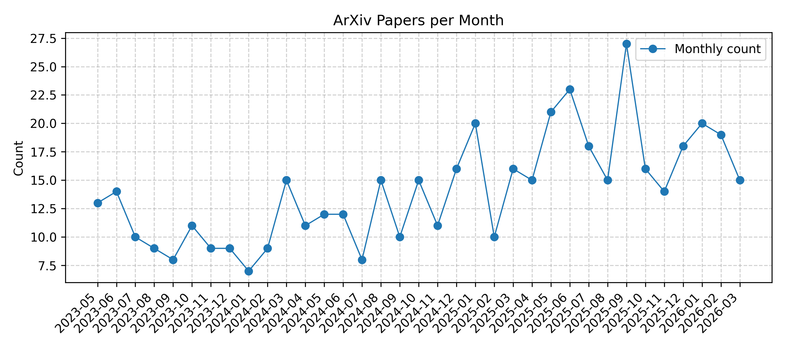

[![Contributors][contributors-shield]][contributors-url]
[![Forks][forks-shield]][forks-url]
[![Stargazers][stars-shield]][stars-url]
[![Issues][issues-shield]][issues-url]

This repository tracks the latest GraphRAG related papers from arXiv.

## Updated on 2026.02.10

## graphrag

|Date|Title|PDF|Code|
|---|---|---|---|
|**2026-02-09**|**Retrieval Pivot Attacks in Hybrid RAG: Measuring and Mitigating Amplified Leakage from Vector Seeds to Graph Expansion**|[2602.08668v1](http://arxiv.org/abs/2602.08668v1)| null|
|**2026-02-09**|**SCOUT-RAG: Scalable and Cost-Efficient Unifying Traversal for Agentic Graph-RAG over Distributed Domains**|[2602.08400v1](http://arxiv.org/abs/2602.08400v1)| null|
|**2026-02-09**|**MemAdapter: Fast Alignment across Agent Memory Paradigms via Generative Subgraph Retrieval**|[2602.08369v1](http://arxiv.org/abs/2602.08369v1)| null|
|**2026-02-08**|**Graph-Enhanced Deep Reinforcement Learning for Multi-Objective Unrelated Parallel Machine Scheduling**|[2602.08052v1](http://arxiv.org/abs/2602.08052v1)| null|
|**2026-02-06**|**Subgraph Reconstruction Attacks on Graph RAG Deployments with Practical Defenses**|[2602.06495v1](http://arxiv.org/abs/2602.06495v1)| null|
|**2026-02-02**|**Graph-Augmented Reasoning with Large Language Models for Tobacco Pest and Disease Management**|[2602.02635v1](http://arxiv.org/abs/2602.02635v1)| null|
|**2026-02-03**|**WildGraphBench: Benchmarking GraphRAG with Wild-Source Corpora**|[2602.02053v2](http://arxiv.org/abs/2602.02053v2)| **[code](https://github.com/BstWPY/WildGraphBench)**|
|**2025-11-27**|**Unlocking Electronic Health Records: A Hybrid Graph RAG Approach to Safe Clinical AI for Patient QA**|[2602.00009v1](http://arxiv.org/abs/2602.00009v1)| null|
|**2026-01-29**|**Bridging Graph Structure and Knowledge-Guided Editing for Interpretable Temporal Knowledge Graph Reasoning**|[2601.21978v1](http://arxiv.org/abs/2601.21978v1)| null|
|**2026-01-26**|**FastInsight: Fast and Insightful Retrieval via Fusion Operators for Graph RAG**|[2601.18579v1](http://arxiv.org/abs/2601.18579v1)| null|
|**2026-01-25**|**ProGraph-R1: Progress-aware Reinforcement Learning for Graph Retrieval Augmented Generation**|[2601.17755v1](http://arxiv.org/abs/2601.17755v1)| null|
|**2026-01-23**|**MAGE-KT: Multi-Agent Graph-Enhanced Knowledge Tracing with Subgraph Retrieval and Asymmetric Fusion**|[2601.16886v1](http://arxiv.org/abs/2601.16886v1)| null|
|**2026-01-21**|**Query-Efficient Agentic Graph Extraction Attacks on GraphRAG Systems**|[2601.14662v1](http://arxiv.org/abs/2601.14662v1)| null|
|**2026-01-19**|**Graph Reasoning Paradigm: Structured and Symbolic Reasoning with Topology-Aware Reinforcement Learning for Large Language Models**|[2601.12995v1](http://arxiv.org/abs/2601.12995v1)| null|
|**2026-01-25**|**Augmenting Question Answering with A Hybrid RAG Approach**|[2601.12658v2](http://arxiv.org/abs/2601.12658v2)| null|
|**2026-01-29**|**Deep GraphRAG: A Balanced Approach to Hierarchical Retrieval and Adaptive Integration**|[2601.11144v3](http://arxiv.org/abs/2601.11144v3)| null|
|**2026-01-16**|**CoG: Controllable Graph Reasoning via Relational Blueprints and Failure-Aware Refinement over Knowledge Graphs**|[2601.11047v1](http://arxiv.org/abs/2601.11047v1)| null|
|**2026-01-14**|**ReGraM: Region-First Knowledge Graph Reasoning for Medical Question Answering**|[2601.09280v1](http://arxiv.org/abs/2601.09280v1)| null|
|**2026-02-03**|**When to Trust: A Causality-Aware Calibration Framework for Accurate Knowledge Graph Retrieval-Augmented Generation**|[2601.09241v2](http://arxiv.org/abs/2601.09241v2)| null|
|**2026-01-13**|**Reliable Graph-RAG for Codebases: AST-Derived Graphs vs LLM-Extracted Knowledge Graphs**|[2601.08773v1](http://arxiv.org/abs/2601.08773v1)| null|
|**2026-01-12**|**GROKE: Vision-Free Navigation Instruction Evaluation via Graph Reasoning on OpenStreetMap**|[2601.07375v1](http://arxiv.org/abs/2601.07375v1)| **[code](https://anonymous.4open.science/r/groke)**|
|**2026-01-12**|**Relink: Constructing Query-Driven Evidence Graph On-the-Fly for GraphRAG**|[2601.07192v1](http://arxiv.org/abs/2601.07192v1)| null|
|**2026-01-09**|**Cumulative Path-Level Semantic Reasoning for Inductive Knowledge Graph Completion**|[2601.05629v1](http://arxiv.org/abs/2601.05629v1)| null|
|**2026-01-12**|**TagRAG: Tag-guided Hierarchical Knowledge Graph Retrieval-Augmented Generation**|[2601.05254v2](http://arxiv.org/abs/2601.05254v2)| null|
|**2026-01-08**|**Self-MedRAG: a Self-Reflective Hybrid Retrieval-Augmented Generation Framework for Reliable Medical Question Answering**|[2601.04531v1](http://arxiv.org/abs/2601.04531v1)| null|
|**2026-01-01**|**Making Theft Useless: Adulteration-Based Protection of Proprietary Knowledge Graphs in GraphRAG Systems**|[2601.00274v1](http://arxiv.org/abs/2601.00274v1)| null|
|**2026-01-01**|**From Evidence-Based Medicine to Knowledge Graph: Retrieval-Augmented Generation for Sports Rehabilitation and a Domain Benchmark**|[2601.00216v1](http://arxiv.org/abs/2601.00216v1)| null|
|**2026-01-01**|**Knowledge Distillation for Temporal Knowledge Graph Reasoning with Large Language Models**|[2601.00202v1](http://arxiv.org/abs/2601.00202v1)| null|
|**2026-01-03**|**The Gaining Paths to Investment Success: Information-Driven LLM Graph Reasoning for Venture Capital Prediction**|[2512.23489v2](http://arxiv.org/abs/2512.23489v2)| **[code](https://anonymous.4open.science/r/MIRAGE-VC-323F)**|
|**2025-12-24**|**LookPlanGraph: Embodied Instruction Following Method with VLM Graph Augmentation**|[2512.21243v1](http://arxiv.org/abs/2512.21243v1)| **[code](https://lookplangraph.github.io)**|
|**2025-12-24**|**M$^3$KG-RAG: Multi-hop Multimodal Knowledge Graph-enhanced Retrieval-Augmented Generation**|[2512.20136v2](http://arxiv.org/abs/2512.20136v2)| null|
|**2025-12-19**|**Grad: Guided Relation Diffusion Generation for Graph Augmentation in Graph Fraud Detection**|[2512.18133v1](http://arxiv.org/abs/2512.18133v1)| **[code](https://github.com/Muyiiiii/WWW25-Grad)**|
|**2025-11-26**|**Graph-O1 : Monte Carlo Tree Search with Reinforcement Learning for Text-Attributed Graph Reasoning**|[2512.17912v1](http://arxiv.org/abs/2512.17912v1)| null|
|**2025-12-16**|**GR-Agent: Adaptive Graph Reasoning Agent under Incomplete Knowledge**|[2512.14766v1](http://arxiv.org/abs/2512.14766v1)| null|
|**2025-12-24**|**Compressed Causal Reasoning: Quantization and GraphRAG Effects on Interventional and Counterfactual Accuracy**|[2512.13725v2](http://arxiv.org/abs/2512.13725v2)| null|
|**2026-01-09**|**DynaGen: Unifying Temporal Knowledge Graph Reasoning with Dynamic Subgraphs and Generative Regularization**|[2512.12669v2](http://arxiv.org/abs/2512.12669v2)| null|
|**2025-12-14**|**StruProKGR: A Structural and Probabilistic Framework for Sparse Knowledge Graph Reasoning**|[2512.12613v1](http://arxiv.org/abs/2512.12613v1)| null|
|**2025-12-13**|**TA-KAND: Two-stage Attention Triple Enhancement and U-KAN based Diffusion For Few-shot Knowledge Graph Completion**|[2512.12182v1](http://arxiv.org/abs/2512.12182v1)| null|
|**2025-12-13**|**Citation-Grounded Code Comprehension: Preventing LLM Hallucination Through Hybrid Retrieval and Graph-Augmented Context**|[2512.12117v1](http://arxiv.org/abs/2512.12117v1)| null|
|**2025-12-15**|**EmeraldMind: A Knowledge Graph-Augmented Framework for Greenwashing Detection**|[2512.11506v2](http://arxiv.org/abs/2512.11506v2)| null|
|**2026-02-02**|**Encoder-Free Knowledge-Graph Reasoning with LLMs via Hyperdimensional Path Retrieval**|[2512.09369v2](http://arxiv.org/abs/2512.09369v2)| null|
|**2025-12-09**|**Detecting Hallucinations in Graph Retrieval-Augmented Generation via Attention Patterns and Semantic Alignment**|[2512.09148v1](http://arxiv.org/abs/2512.09148v1)| null|
|**2025-12-06**|**How Sharp and Bias-Robust is a Model? Dual Evaluation Perspectives on Knowledge Graph Completion**|[2512.06296v1](http://arxiv.org/abs/2512.06296v1)| null|
|**2025-12-05**|**GRASP: Graph Reasoning Agents for Systems Pharmacology with Human-in-the-Loop**|[2512.05502v1](http://arxiv.org/abs/2512.05502v1)| null|
|**2025-12-01**|**Graph Distance as Surprise: Free Energy Minimization in Knowledge Graph Reasoning**|[2512.01878v1](http://arxiv.org/abs/2512.01878v1)| null|
|**2025-12-02**|**Knowledge Graph Augmented Large Language Models for Disease Prediction**|[2512.01210v2](http://arxiv.org/abs/2512.01210v2)| null|
|**2025-12-08**|**Subgoal Graph-Augmented Planning for LLM-Guided Open-World Reinforcement Learning**|[2511.20993v2](http://arxiv.org/abs/2511.20993v2)| null|
|**2025-12-02**|**PersonaAgent with GraphRAG: Community-Aware Knowledge Graphs for Personalized LLM**|[2511.17467v2](http://arxiv.org/abs/2511.17467v2)| **[code](https://anonymous.4open.science/r/PersonaAgentwGraphRAG-DE6F)**|
|**2025-12-10**|**PathMind: A Retrieve-Prioritize-Reason Framework for Knowledge Graph Reasoning with Large Language Models**|[2511.14256v2](http://arxiv.org/abs/2511.14256v2)| null|
|**2025-11-26**|**Lost in Serialization: Invariance and Generalization of LLM Graph Reasoners**|[2511.10234v2](http://arxiv.org/abs/2511.10234v2)| null|
|**2025-11-11**|**Automatic Paper Reviewing with Heterogeneous Graph Reasoning over LLM-Simulated Reviewer-Author Debates**|[2511.08317v1](http://arxiv.org/abs/2511.08317v1)| null|
|**2025-11-11**|**Multi-Agent GraphRAG: A Text-to-Cypher Framework for Labeled Property Graphs**|[2511.08274v1](http://arxiv.org/abs/2511.08274v1)| null|
|**2025-11-11**|**DANS-KGC: Diffusion Based Adaptive Negative Sampling for Knowledge Graph Completion**|[2511.07901v1](http://arxiv.org/abs/2511.07901v1)| null|
|**2025-11-06**|**GRIP: In-Parameter Graph Reasoning through Fine-Tuning Large Language Models**|[2511.07457v1](http://arxiv.org/abs/2511.07457v1)| null|
|**2025-11-07**|**DGTN: Graph-Enhanced Transformer with Diffusive Attention Gating Mechanism for Enzyme DDG Prediction**|[2511.05483v1](http://arxiv.org/abs/2511.05483v1)| null|
|**2025-11-06**|**SPECTRA: Spectral Target-Aware Graph Augmentation for Imbalanced Molecular Property Regression**|[2511.04838v1](http://arxiv.org/abs/2511.04838v1)| null|
|**2025-12-04**|**Ground-Truth Subgraphs for Better Training and Evaluation of Knowledge Graph Augmented LLMs**|[2511.04473v2](http://arxiv.org/abs/2511.04473v2)| null|
|**2025-11-04**|**Knowledge Graph-enhanced Large Language Model for Incremental Game PlayTesting**|[2511.02534v1](http://arxiv.org/abs/2511.02534v1)| null|
|**2025-11-03**|**PROPEX-RAG: Enhanced GraphRAG using Prompt-Driven Prompt Execution**|[2511.01802v1](http://arxiv.org/abs/2511.01802v1)| null|
|**2025-11-17**|**Hybrid Retrieval-Augmented Generation Agent for Trustworthy Legal Question Answering in Judicial Forensics**|[2511.01668v2](http://arxiv.org/abs/2511.01668v2)| null|
|**2025-10-30**|**Graph-Enhanced Policy Optimization in LLM Agent Training**|[2510.26270v1](http://arxiv.org/abs/2510.26270v1)| null|
|**2025-11-25**|**AirFed: A Federated Graph-Enhanced Multi-Agent Reinforcement Learning Framework for Multi-UAV Cooperative Mobile Edge Computing**|[2510.23053v2](http://arxiv.org/abs/2510.23053v2)| null|
|**2026-01-21**|**Conjugate Relation Modeling for Few-Shot Knowledge Graph Completion**|[2510.22656v2](http://arxiv.org/abs/2510.22656v2)| null|
|**2026-01-06**|**ELMM: Efficient Lightweight Multimodal Large Language Models for Multimodal Knowledge Graph Completion**|[2510.16753v2](http://arxiv.org/abs/2510.16753v2)| null|
|**2025-10-21**|**Uncertain Knowledge Graph Completion via Semi-Supervised Confidence Distribution Learning**|[2510.16601v2](http://arxiv.org/abs/2510.16601v2)| null|
|**2025-10-18**|**MGTS-Net: Exploring Graph-Enhanced Multimodal Fusion for Augmented Time Series Forecasting**|[2510.16350v1](http://arxiv.org/abs/2510.16350v1)| null|
|**2025-10-15**|**Knowledge Reasoning Language Model: Unifying Knowledge and Language for Inductive Knowledge Graph Reasoning**|[2510.13909v1](http://arxiv.org/abs/2510.13909v1)| **[code](https://anonymous.4open.science/r/KRLM-EA36)**|
|**2025-10-15**|**MemoTime: Memory-Augmented Temporal Knowledge Graph Enhanced Large Language Model Reasoning**|[2510.13614v1](http://arxiv.org/abs/2510.13614v1)| null|
|**2025-10-11**|**KG-MAS: Knowledge Graph-Enhanced Multi-Agent Infrastructure for coupling physical and digital robotic environments**|[2510.10325v1](http://arxiv.org/abs/2510.10325v1)| null|
|**2025-11-09**|**LinearRAG: Linear Graph Retrieval Augmented Generation on Large-scale Corpora**|[2510.10114v4](http://arxiv.org/abs/2510.10114v4)| **[code](https://github.com/DEEP-PolyU/LinearRAG)**|
|**2025-10-10**|**Semantic-Condition Tuning: Fusing Graph Context with Large Language Models for Knowledge Graph Completion**|[2510.08966v1](http://arxiv.org/abs/2510.08966v1)| null|
|**2025-10-10**|**EcphoryRAG: Re-Imagining Knowledge-Graph RAG via Human Associative Memory**|[2510.08958v1](http://arxiv.org/abs/2510.08958v1)| null|
|**2025-10-09**|**Multilingual Knowledge Graph Completion via Efficient Multilingual Knowledge Sharing**|[2510.07736v1](http://arxiv.org/abs/2510.07736v1)| **[code](https://github.com/gaoxiaofei07/KL-GMoE)**|
|**2025-10-24**|**SUBQRAG: Sub-Question Driven Dynamic Graph RAG**|[2510.07718v2](http://arxiv.org/abs/2510.07718v2)| null|
|**2025-10-03**|**StepChain GraphRAG: Reasoning Over Knowledge Graphs for Multi-Hop Question Answering**|[2510.02827v1](http://arxiv.org/abs/2510.02827v1)| null|
|**2026-01-12**|**SLogic: Subgraph-Informed Logical Rule Learning for Knowledge Graph Completion**|[2510.00279v2](http://arxiv.org/abs/2510.00279v2)| null|
|**2026-01-27**|**Efficient and Transferable Agentic Knowledge Graph RAG via Reinforcement Learning**|[2509.26383v4](http://arxiv.org/abs/2509.26383v4)| **[code](https://github.com/Jinyeop3110/KG-R1)**|
|**2025-09-29**|**Beyond Static Retrieval: Opportunities and Pitfalls of Iterative Retrieval in GraphRAG**|[2509.25530v1](http://arxiv.org/abs/2509.25530v1)| null|
|**2025-09-29**|**GESA: Graph-Enhanced Semantic Allocation for Generalized, Fair, and Explainable Candidate-Role Matching**|[2509.25435v1](http://arxiv.org/abs/2509.25435v1)| null|
|**2025-09-27**|**RANGER -- Repository-Level Agent for Graph-Enhanced Retrieval**|[2509.25257v1](http://arxiv.org/abs/2509.25257v1)| null|
|**2025-10-02**|**Rethinking and Benchmarking Large Language Models for Graph Reasoning**|[2509.24260v2](http://arxiv.org/abs/2509.24260v2)| null|
|**2025-09-28**|**Transformer Tafsir at QIAS 2025 Shared Task: Hybrid Retrieval-Augmented Generation for Islamic Knowledge Question Answering**|[2509.23793v1](http://arxiv.org/abs/2509.23793v1)| null|
|**2025-09-28**|**Collaboration of Fusion and Independence: Hypercomplex-driven Robust Multi-Modal Knowledge Graph Completion**|[2509.23714v1](http://arxiv.org/abs/2509.23714v1)| null|
|**2025-09-27**|**Fin-ExBERT: User Intent based Text Extraction in Financial Context using Graph-Augmented BERT and trainable Plugin**|[2509.23259v1](http://arxiv.org/abs/2509.23259v1)| null|
|**2025-09-30**|**GraphSearch: An Agentic Deep Searching Workflow for Graph Retrieval-Augmented Generation**|[2509.22009v2](http://arxiv.org/abs/2509.22009v2)| null|
|**2025-09-25**|**Query-Centric Graph Retrieval Augmented Generation**|[2509.21237v1](http://arxiv.org/abs/2509.21237v1)| null|
|**2025-09-25**|**CLAUSE: Agentic Neuro-Symbolic Knowledge Graph Reasoning via Dynamic Learnable Context Engineering**|[2509.21035v1](http://arxiv.org/abs/2509.21035v1)| null|
|**2025-12-16**|**GALAX: Graph-Augmented Language Model for Explainable Reinforcement-Guided Subgraph Reasoning in Precision Medicine**|[2509.20935v2](http://arxiv.org/abs/2509.20935v2)| null|
|**2025-09-24**|**Uncovering Graph Reasoning in Decoder-only Transformers with Circuit Tracing**|[2509.20336v1](http://arxiv.org/abs/2509.20336v1)| null|
|**2025-09-22**|**Graph Enhanced Trajectory Anomaly Detection**|[2509.18386v1](http://arxiv.org/abs/2509.18386v1)| null|
|**2025-09-22**|**Periodic Graph-Enhanced Multivariate Time Series Anomaly Detector**|[2509.17472v1](http://arxiv.org/abs/2509.17472v1)| null|
|**2025-09-26**|**Comparing RAG and GraphRAG for Page-Level Retrieval Question Answering on Math Textbook**|[2509.16780v2](http://arxiv.org/abs/2509.16780v2)| null|
|**2025-09-15**|**Graph-Enhanced Retrieval-Augmented Question Answering for E-Commerce Customer Support**|[2509.14267v1](http://arxiv.org/abs/2509.14267v1)| null|
|**2025-09-16**|**Zero-shot Graph Reasoning via Retrieval Augmented Framework with LLMs**|[2509.12743v1](http://arxiv.org/abs/2509.12743v1)| null|
|**2025-09-01**|**Towards Scalable O-RAN Resource Management: Graph-Augmented Proximal Policy Optimization**|[2509.10499v1](http://arxiv.org/abs/2509.10499v1)| null|
|**2025-09-24**|**Structure Matters: Brain Graph Augmentation via Learnable Edge Masking for Data-efficient Psychiatric Diagnosis**|[2509.09744v4](http://arxiv.org/abs/2509.09744v4)| **[code](https://github.com/mjliu99/SAM-BG)**|
|**2025-09-09**|**GENUINE: Graph Enhanced Multi-level Uncertainty Estimation for Large Language Models**|[2509.07925v1](http://arxiv.org/abs/2509.07925v1)| **[code](https://github.com/ODYSSEYWT/GUQ)**|
|**2025-09-08**|**SLiNT: Structure-aware Language Model with Injection and Contrastive Training for Knowledge Graph Completion**|[2509.06531v1](http://arxiv.org/abs/2509.06531v1)| null|
|**2025-09-05**|**KGRAG-SC: Knowledge Graph RAG-Assisted Semantic Communication**|[2509.04801v1](http://arxiv.org/abs/2509.04801v1)| null|
|**2025-09-03**|**Explainable Knowledge Graph Retrieval-Augmented Generation (KG-RAG) with KG-SMILE**|[2509.03626v1](http://arxiv.org/abs/2509.03626v1)| null|
|**2025-09-01**|**Enhancing Large Language Model for Knowledge Graph Completion via Structure-Aware Alignment-Tuning**|[2509.01166v1](http://arxiv.org/abs/2509.01166v1)| null|
|**2025-08-30**|**KG-RAG: Enhancing GUI Agent Decision-Making via Knowledge Graph-Driven Retrieval-Augmented Generation**|[2509.00366v1](http://arxiv.org/abs/2509.00366v1)| null|
|**2025-09-07**|**Robotic Fire Risk Detection based on Dynamic Knowledge Graph Reasoning: An LLM-Driven Approach with Graph Chain-of-Thought**|[2509.00054v2](http://arxiv.org/abs/2509.00054v2)| null|
|**2025-09-03**|**Youtu-GraphRAG: Vertically Unified Agents for Graph Retrieval-Augmented Complex Reasoning**|[2508.19855v3](http://arxiv.org/abs/2508.19855v3)| null|
|**2025-08-24**|**Exposing Privacy Risks in Graph Retrieval-Augmented Generation**|[2508.17222v1](http://arxiv.org/abs/2508.17222v1)| null|
|**2025-09-05**|**Graph RAG as Human Choice Model: Building a Data-Driven Mobility Agent with Preference Chain**|[2508.16172v2](http://arxiv.org/abs/2508.16172v2)| null|
|**2025-08-21**|**KG-EDAS: A Meta-Metric Framework for Evaluating Knowledge Graph Completion Models**|[2508.15357v1](http://arxiv.org/abs/2508.15357v1)| null|
|**2025-08-19**|**Knowledge Graph Completion for Action Prediction on Situational Graphs -- A Case Study on Household Tasks**|[2508.13675v1](http://arxiv.org/abs/2508.13675v1)| null|
|**2025-08-18**|**GTool: Graph Enhanced Tool Planning with Large Language Model**|[2508.12725v1](http://arxiv.org/abs/2508.12725v1)| null|
|**2025-08-17**|**GALA: Can Graph-Augmented Large Language Model Agentic Workflows Elevate Root Cause Analysis?**|[2508.12472v1](http://arxiv.org/abs/2508.12472v1)| null|
|**2025-08-13**|**Towards Self-cognitive Exploration: Metacognitive Knowledge Graph Retrieval Augmented Generation**|[2508.09460v1](http://arxiv.org/abs/2508.09460v1)| null|
|**2025-08-08**|**Probabilistic Circuits for Knowledge Graph Completion with Reduced Rule Sets**|[2508.06706v1](http://arxiv.org/abs/2508.06706v1)| null|
|**2025-07-20**|**Med-GRIM: Enhanced Zero-Shot Medical VQA using prompt-embedded Multimodal Graph RAG**|[2508.06496v1](http://arxiv.org/abs/2508.06496v1)| **[code](https://github.com/Rakesh-123-cryp/Med-GRIM.git)**|
|**2025-08-08**|**Semantic Item Graph Enhancement for Multimodal Recommendation**|[2508.06154v1](http://arxiv.org/abs/2508.06154v1)| null|
|**2025-07-30**|**Open-Source Agentic Hybrid RAG Framework for Scientific Literature Review**|[2508.05660v1](http://arxiv.org/abs/2508.05660v1)| null|
|**2025-08-06**|**AgREE: Agentic Reasoning for Knowledge Graph Completion on Emerging Entities**|[2508.04118v1](http://arxiv.org/abs/2508.04118v1)| null|
|**2025-08-04**|**Beyond Chunks and Graphs: Retrieval-Augmented Generation through Triplet-Driven Thinking**|[2508.02435v1](http://arxiv.org/abs/2508.02435v1)| **[code](https://github.com/rockcor/T2RAG)**|
|**2025-08-03**|**T-GRAG: A Dynamic GraphRAG Framework for Resolving Temporal Conflicts and Redundancy in Knowledge Retrieval**|[2508.01680v1](http://arxiv.org/abs/2508.01680v1)| null|
|**2026-01-27**|**GraphRAG-R1: Graph Retrieval-Augmented Generation with Process-Constrained Reinforcement Learning**|[2507.23581v2](http://arxiv.org/abs/2507.23581v2)| null|
|**2025-07-29**|**Unifying Post-hoc Explanations of Knowledge Graph Completions**|[2507.22951v1](http://arxiv.org/abs/2507.22951v1)| null|
|**2025-07-29**|**Graph-R1: Towards Agentic GraphRAG Framework via End-to-end Reinforcement Learning**|[2507.21892v1](http://arxiv.org/abs/2507.21892v1)| null|
|**2025-07-29**|**DGP: A Dual-Granularity Prompting Framework for Fraud Detection with Graph-Enhanced LLMs**|[2507.21653v1](http://arxiv.org/abs/2507.21653v1)| null|
|**2025-08-30**|**Graph-Augmented Large Language Model Agents: Current Progress and Future Prospects**|[2507.21407v2](http://arxiv.org/abs/2507.21407v2)| null|
|**2025-10-21**|**Ontology-Enhanced Knowledge Graph Completion using Large Language Models**|[2507.20643v2](http://arxiv.org/abs/2507.20643v2)| null|
|**2025-07-28**|**Mixture of Length and Pruning Experts for Knowledge Graphs Reasoning**|[2507.20498v1](http://arxiv.org/abs/2507.20498v1)| null|
|**2025-07-25**|**Beyond Nearest Neighbors: Semantic Compression and Graph-Augmented Retrieval for Enhanced Vector Search**|[2507.19715v1](http://arxiv.org/abs/2507.19715v1)| null|
|**2025-07-25**|**When Noisy Labels Meet Class Imbalance on Graphs: A Graph Augmentation Method with LLM and Pseudo Label**|[2507.18153v2](http://arxiv.org/abs/2507.18153v2)| null|
|**2025-07-23**|**Millions of $\text{GeAR}$-s: Extending GraphRAG to Millions of Documents**|[2507.17399v1](http://arxiv.org/abs/2507.17399v1)| null|
|**2025-10-15**|**DynaSearcher: Dynamic Knowledge Graph Augmented Search Agent via Multi-Reward Reinforcement Learning**|[2507.17365v2](http://arxiv.org/abs/2507.17365v2)| null|
|**2025-07-16**|**DyG-RAG: Dynamic Graph Retrieval-Augmented Generation with Event-Centric Reasoning**|[2507.13396v1](http://arxiv.org/abs/2507.13396v1)| **[code](https://github.com/RingBDStack/DyG-RAG)**|
|**2025-09-29**|**DuetGraph: Coarse-to-Fine Knowledge Graph Reasoning with Dual-Pathway Global-Local Fusion**|[2507.11229v2](http://arxiv.org/abs/2507.11229v2)| **[code](https://github.com/USTC-DataDarknessLab/DuetGraph.git)**|
|**2025-07-11**|**KGRAG-Ex: Explainable Retrieval-Augmented Generation with Knowledge Graph-based Perturbations**|[2507.08443v1](http://arxiv.org/abs/2507.08443v1)| null|
|**2025-07-10**|**Rule Learning for Knowledge Graph Reasoning under Agnostic Distribution Shift**|[2507.05110v3](http://arxiv.org/abs/2507.05110v3)| null|
|**2025-08-20**|**Benchmarking Vector, Graph and Hybrid Retrieval Augmented Generation (RAG) Pipelines for Open Radio Access Networks (ORAN)**|[2507.03608v2](http://arxiv.org/abs/2507.03608v2)| null|
|**2025-12-18**|**Towards Practical GraphRAG: Efficient Knowledge Graph Construction and Hybrid Retrieval at Scale**|[2507.03226v3](http://arxiv.org/abs/2507.03226v3)| null|
|**2025-07-02**|**T3DM: Test-Time Training-Guided Distribution Shift Modelling for Temporal Knowledge Graph Reasoning**|[2507.01597v1](http://arxiv.org/abs/2507.01597v1)| null|
|**2025-09-10**|**Context-Driven Knowledge Graph Completion with Semantic-Aware Relational Message Passing**|[2506.23141v2](http://arxiv.org/abs/2506.23141v2)| null|
|**2025-08-30**|**Flow-Modulated Scoring for Semantic-Aware Knowledge Graph Completion**|[2506.23137v3](http://arxiv.org/abs/2506.23137v3)| **[code](https://github.com/yuanwuyuan9/FMS)**|
|**2025-06-27**|**Evaluating Hybrid Retrieval Augmented Generation using Dynamic Test Sets: LiveRAG Challenge**|[2506.22644v1](http://arxiv.org/abs/2506.22644v1)| null|
|**2025-06-26**|**Weak-to-Strong GraphRAG: Aligning Weak Retrievers with Large Language Models for Graph-based Retrieval Augmented Generation**|[2506.22518v1](http://arxiv.org/abs/2506.22518v1)| null|
|**2025-08-06**|**GraphRAG-Induced Dual Knowledge Structure Graphs for Personalized Learning Path Recommendation**|[2506.22303v2](http://arxiv.org/abs/2506.22303v2)| null|
|**2025-06-27**|**Hyper-modal Imputation Diffusion Embedding with Dual-Distillation for Federated Multimodal Knowledge Graph Completion**|[2506.22036v1](http://arxiv.org/abs/2506.22036v1)| null|
|**2025-06-15**|**STRuCT-LLM: Unifying Tabular and Graph Reasoning with Reinforcement Learning for Semantic Parsing**|[2506.21575v1](http://arxiv.org/abs/2506.21575v1)| **[code](https://github.com/bouv/STRuCT-LLM)**|
|**2025-06-24**|**Inference Scaled GraphRAG: Improving Multi Hop Question Answering on Knowledge Graphs**|[2506.19967v1](http://arxiv.org/abs/2506.19967v1)| null|
|**2026-02-09**|**CID-GraphRAG: Enhancing Multi-Turn Dialogue Systems through Dual-Pathway Retrieval of Conversation Flow and Context Semantics**|[2506.19385v4](http://arxiv.org/abs/2506.19385v4)| null|
|**2025-06-18**|**Research on Graph-Retrieval Augmented Generation Based on Historical Text Knowledge Graphs**|[2506.15241v1](http://arxiv.org/abs/2506.15241v1)| null|
|**2025-06-15**|**Multi-document Summarization through Multi-document Event Relation Graph Reasoning in LLMs: a case study in Framing Bias Mitigation**|[2506.12978v1](http://arxiv.org/abs/2506.12978v1)| null|
|**2025-06-13**|**GraphRAG-Causal: A novel graph-augmented framework for causal reasoning and annotation in news**|[2506.11600v1](http://arxiv.org/abs/2506.11600v1)| null|
|**2025-04-27**|**A Survey of Task-Oriented Knowledge Graph Reasoning: Status, Applications, and Prospects**|[2506.11012v1](http://arxiv.org/abs/2506.11012v1)| null|
|**2025-06-09**|**LlamaRec-LKG-RAG: A Single-Pass, Learnable Knowledge Graph-RAG Framework for LLM-Based Ranking**|[2506.07449v1](http://arxiv.org/abs/2506.07449v1)| **[code](https://github.com/VahidAz/LlamaRec-LKG-RAG}{repository})**|
|**2025-10-15**|**KG2QA: Knowledge Graph-enhanced Retrieval-augmented Generation for Communication Standards Question Answering**|[2506.07037v2](http://arxiv.org/abs/2506.07037v2)| **[code](https://github.com/luozhongze/KG2QA)**|
|**2025-06-04**|**Towards Foundation Model on Temporal Knowledge Graph Reasoning**|[2506.06367v1](http://arxiv.org/abs/2506.06367v1)| null|
|**2025-05-31**|**How Significant Are the Real Performance Gains? An Unbiased Evaluation Framework for GraphRAG**|[2506.06331v1](http://arxiv.org/abs/2506.06331v1)| null|
|**2025-10-07**|**When to use Graphs in RAG: A Comprehensive Analysis for Graph Retrieval-Augmented Generation**|[2506.05690v2](http://arxiv.org/abs/2506.05690v2)| **[code](https://github.com/GraphRAG-Bench/GraphRAG-Benchmark)**|
|**2025-06-01**|**A Graph-Retrieval-Augmented Generation Framework Enhances Decision-Making in the Circular Economy**|[2506.04252v1](http://arxiv.org/abs/2506.04252v1)| null|
|**2025-06-04**|**A Generative Adaptive Replay Continual Learning Model for Temporal Knowledge Graph Reasoning**|[2506.04083v1](http://arxiv.org/abs/2506.04083v1)| null|
|**2025-06-03**|**Knowledge Graph Completion by Intermediate Variables Regularization**|[2506.02749v1](http://arxiv.org/abs/2506.02749v1)| **[code](https://github.com/changyi7231/IVR)**|
|**2025-06-20**|**GraphRAG-Bench: Challenging Domain-Specific Reasoning for Evaluating Graph Retrieval-Augmented Generation**|[2506.02404v3](http://arxiv.org/abs/2506.02404v3)| null|
|**2025-11-10**|**DrKGC: Dynamic Subgraph Retrieval-Augmented LLMs for Knowledge Graph Completion across General and Biomedical Domains**|[2506.00708v3](http://arxiv.org/abs/2506.00708v3)| null|
|**2025-10-11**|**SkewRoute: Training-Free LLM Routing for Knowledge Graph Retrieval-Augmented Generation via Score Skewness of Retrieved Context**|[2505.23841v2](http://arxiv.org/abs/2505.23841v2)| **[code](https://github.com/hrwang00/SkewRoute)**|
|**2025-11-03**|**Diagnosing and Addressing Pitfalls in KG-RAG Datasets: Toward More Reliable Benchmarking**|[2505.23495v4](http://arxiv.org/abs/2505.23495v4)| null|
|**2025-05-29**|**Rethinking Regularization Methods for Knowledge Graph Completion**|[2505.23442v1](http://arxiv.org/abs/2505.23442v1)| null|
|**2025-05-28**|**Beyond Completion: A Foundation Model for General Knowledge Graph Reasoning**|[2505.21926v1](http://arxiv.org/abs/2505.21926v1)| null|
|**2025-05-26**|**Self-Reflective Planning with Knowledge Graphs: Enhancing LLM Reasoning Reliability for Question Answering**|[2505.19410v1](http://arxiv.org/abs/2505.19410v1)| null|
|**2025-05-25**|**Learn Beneficial Noise as Graph Augmentation**|[2505.19024v1](http://arxiv.org/abs/2505.19024v1)| null|
|**2025-05-25**|**Is Architectural Complexity Overrated? Competitive and Interpretable Knowledge Graph Completion with RelatE**|[2505.18971v1](http://arxiv.org/abs/2505.18971v1)| null|
|**2025-05-23**|**RECIPE-TKG: From Sparse History to Structured Reasoning for LLM-based Temporal Knowledge Graph Completion**|[2505.17794v1](http://arxiv.org/abs/2505.17794v1)| null|
|**2025-05-17**|**DO-RAG: A Domain-Specific QA Framework Using Knowledge Graph-Enhanced Retrieval-Augmented Generation**|[2505.17058v1](http://arxiv.org/abs/2505.17058v1)| null|
|**2026-01-13**|**Align-GRAG: Anchor and Rationale Guided Dual Alignment for Graph Retrieval-Augmented Generation**|[2505.16237v3](http://arxiv.org/abs/2505.16237v3)| **[code](https://anonymous.4open.science/r/Align-GRAG-F3D8/)**|
|**2025-05-29**|**Disentangled Multi-span Evolutionary Network against Temporal Knowledge Graph Reasoning**|[2505.14020v2](http://arxiv.org/abs/2505.14020v2)| null|
|**2025-05-11**|**RTL++: Graph-enhanced LLM for RTL Code Generation**|[2505.13479v1](http://arxiv.org/abs/2505.13479v1)| null|
|**2025-05-18**|**MPRM: A Markov Path-based Rule Miner for Efficient and Interpretable Knowledge Graph Reasoning**|[2505.12329v1](http://arxiv.org/abs/2505.12329v1)| null|
|**2025-05-18**|**Enhancing Knowledge Graph Completion with GNN Distillation and Probabilistic Interaction Modeling**|[2505.12272v1](http://arxiv.org/abs/2505.12272v1)| **[code](https://anonymous.4open.science/r/APIM_and_GNN-Distillation-461C)**|
|**2025-12-29**|**GraphOracle: Efficient Fully-Inductive Knowledge Graph Reasoning via Relation-Dependency Graphs**|[2505.11125v2](http://arxiv.org/abs/2505.11125v2)| null|
|**2025-05-15**|**GE-Chat: A Graph Enhanced RAG Framework for Evidential Response Generation of LLMs**|[2505.10143v1](http://arxiv.org/abs/2505.10143v1)| null|
|**2025-05-16**|**Leveraging Graph Retrieval-Augmented Generation to Support Learners' Understanding of Knowledge Concepts in MOOCs**|[2505.10074v2](http://arxiv.org/abs/2505.10074v2)| null|
|**2025-09-29**|**KAQG: A Knowledge-Graph-Enhanced RAG for Difficulty-Controlled Question Generation**|[2505.07618v2](http://arxiv.org/abs/2505.07618v2)| null|
|**2025-05-12**|**ReCDAP: Relation-Based Conditional Diffusion with Attention Pooling for Few-Shot Knowledge Graph Completion**|[2505.07171v1](http://arxiv.org/abs/2505.07171v1)| **[code](https://github.com/hou27/ReCDAP-FKGC)**|
|**2025-10-07**|**Soft Reasoning Paths for Knowledge Graph Completion**|[2505.03285v2](http://arxiv.org/abs/2505.03285v2)| null|
|**2025-09-11**|**An Ontology-Driven Graph RAG for Legal Norms: A Structural, Temporal, and Deterministic Approach**|[2505.00039v5](http://arxiv.org/abs/2505.00039v5)| null|
|**2025-06-27**|**OpenTCM: A GraphRAG-Empowered LLM-based System for Traditional Chinese Medicine Knowledge Retrieval and Diagnosis**|[2504.20118v4](http://arxiv.org/abs/2504.20118v4)| null|
|**2025-09-09**|**Tripartite-GraphRAG via Plugin Ontologies**|[2504.19667v3](http://arxiv.org/abs/2504.19667v3)| null|
|**2025-04-23**|**LLM-assisted Graph-RAG Information Extraction from IFC Data**|[2504.16813v1](http://arxiv.org/abs/2504.16813v1)| null|
|**2025-04-19**|**LegalRAG: A Hybrid RAG System for Multilingual Legal Information Retrieval**|[2504.16121v1](http://arxiv.org/abs/2504.16121v1)| null|
|**2025-04-21**|**KGMEL: Knowledge Graph-Enhanced Multimodal Entity Linking**|[2504.15135v1](http://arxiv.org/abs/2504.15135v1)| **[code](https://github.com/juyeonnn/KGMEL)**|
|**2025-06-10**|**On Large-scale Evaluation of Embedding Models for Knowledge Graph Completion**|[2504.08970v2](http://arxiv.org/abs/2504.08970v2)| null|
|**2025-04-09**|**A Graph-Enhanced DeepONet Approach for Real-Time Estimating Hydrogen-Enriched Natural Gas Flow under Variable Operations**|[2504.08816v1](http://arxiv.org/abs/2504.08816v1)| null|
|**2025-03-13**|**FG-RAG: Enhancing Query-Focused Summarization with Context-Aware Fine-Grained Graph RAG**|[2504.07103v1](http://arxiv.org/abs/2504.07103v1)| **[code](https://github.com/BuptWululu/FG-RAG)**|
|**2025-04-09**|**DiffusionCom: Structure-Aware Multimodal Diffusion Model for Multimodal Knowledge Graph Completion**|[2504.06543v1](http://arxiv.org/abs/2504.06543v1)| null|
|**2025-04-30**|**Knowledge Graph Completion with Relation-Aware Anchor Enhancement**|[2504.06129v2](http://arxiv.org/abs/2504.06129v2)| null|
|**2025-04-06**|**Hierarchical Planning for Complex Tasks with Knowledge Graph-RAG and Symbolic Verification**|[2504.04578v1](http://arxiv.org/abs/2504.04578v1)| null|
|**2025-03-29**|**TransNet: Transfer Knowledge for Few-shot Knowledge Graph Completion**|[2504.03720v1](http://arxiv.org/abs/2504.03720v1)| **[code](https://github.com/lihuiliullh/TransNet/tree/main)**|
|**2025-04-03**|**Knowledge Graph Completion with Mixed Geometry Tensor Factorization**|[2504.02589v1](http://arxiv.org/abs/2504.02589v1)| null|
|**2025-11-01**|**PolyG: Adaptive Graph Traversal for Diverse GraphRAG Questions**|[2504.02112v2](http://arxiv.org/abs/2504.02112v2)| **[code](https://github.com/Liu-rj/PolyG)**|
|**2025-04-01**|**Detecting and Mitigating Bias in LLMs through Knowledge Graph-Augmented Training**|[2504.00310v1](http://arxiv.org/abs/2504.00310v1)| null|
|**2025-03-29**|**Enhancing Knowledge Graph Completion with Entity Neighborhood and Relation Context**|[2503.23205v1](http://arxiv.org/abs/2503.23205v1)| null|
|**2025-07-30**|**Cross-Modal State-Space Graph Reasoning for Structured Summarization**|[2503.20988v2](http://arxiv.org/abs/2503.20988v2)| null|
|**2025-03-26**|**DEMENTIA-PLAN: An Agent-Based Framework for Multi-Knowledge Graph Retrieval-Augmented Generation in Dementia Care**|[2503.20950v1](http://arxiv.org/abs/2503.20950v1)| null|
|**2025-03-26**|**Graph-Enhanced Model-Free Reinforcement Learning Agents for Efficient Power Grid Topological Control**|[2503.20688v1](http://arxiv.org/abs/2503.20688v1)| null|
|**2025-03-24**|**Self-Organizing Graph Reasoning Evolves into a Critical State for Continuous Discovery Through Structural-Semantic Dynamics**|[2503.18852v1](http://arxiv.org/abs/2503.18852v1)| null|
|**2025-03-18**|**Empowering GraphRAG with Knowledge Filtering and Integration**|[2503.13804v1](http://arxiv.org/abs/2503.13804v1)| null|
|**2025-03-16**|**Diffusion on Graph: Augmentation of Graph Structure for Node Classification**|[2503.12563v1](http://arxiv.org/abs/2503.12563v1)| **[code](https://github.com/Statistical-Deep-Learning/DoG)**|
|**2025-03-16**|**GCBLANE: A graph-enhanced convolutional BiLSTM attention network for improved transcription factor binding site prediction**|[2503.12377v1](http://arxiv.org/abs/2503.12377v1)| null|
|**2025-06-04**|**ROGRAG: A Robustly Optimized GraphRAG Framework**|[2503.06474v2](http://arxiv.org/abs/2503.06474v2)| null|
|**2025-05-27**|**Path Pooling: Training-Free Structure Enhancement for Efficient Knowledge Graph Retrieval-Augmented Generation**|[2503.05203v2](http://arxiv.org/abs/2503.05203v2)| null|
|**2025-03-07**|**Memory-augmented Query Reconstruction for LLM-based Knowledge Graph Reasoning**|[2503.05193v1](http://arxiv.org/abs/2503.05193v1)| null|
|**2025-03-05**|**Graph-Augmented LSTM for Forecasting Sparse Anomalies in Graph-Structured Time Series**|[2503.03729v1](http://arxiv.org/abs/2503.03729v1)| null|
|**2025-03-10**|**MuCo-KGC: Multi-Context-Aware Knowledge Graph Completion**|[2503.03091v2](http://arxiv.org/abs/2503.03091v2)| null|
|**2025-03-03**|**Graph-Augmented Reasoning: Evolving Step-by-Step Knowledge Graph Retrieval for LLM Reasoning**|[2503.01642v1](http://arxiv.org/abs/2503.01642v1)| null|
|**2025-06-25**|**Rewarding Graph Reasoning Process makes LLMs more Generalized Reasoners**|[2503.00845v2](http://arxiv.org/abs/2503.00845v2)| null|
|**2025-09-01**|**Personalized Causal Graph Reasoning for LLMs: An Implementation for Dietary Recommendations**|[2503.00134v3](http://arxiv.org/abs/2503.00134v3)| null|
|**2025-02-25**|**Graph Augmentation for Cross Graph Domain Generalization**|[2502.18188v1](http://arxiv.org/abs/2502.18188v1)| null|
|**2025-02-21**|**From Documents to Dialogue: Building KG-RAG Enhanced AI Assistants**|[2502.15237v1](http://arxiv.org/abs/2502.15237v1)| null|
|**2025-02-18**|**Agentic Deep Graph Reasoning Yields Self-Organizing Knowledge Networks**|[2502.13025v1](http://arxiv.org/abs/2502.13025v1)| null|
|**2025-06-29**|**Agentic Medical Knowledge Graphs Enhance Medical Question Answering: Bridging the Gap Between LLMs and Evolving Medical Knowledge**|[2502.13010v3](http://arxiv.org/abs/2502.13010v3)| null|
|**2025-03-18**|**A Graph-Enhanced Deep-Reinforcement Learning Framework for the Aircraft Landing Problem**|[2502.12617v2](http://arxiv.org/abs/2502.12617v2)| null|
|**2025-05-30**|**GLTW: Joint Improved Graph Transformer and LLM via Three-Word Language for Knowledge Graph Completion**|[2502.11471v4](http://arxiv.org/abs/2502.11471v4)| null|
|**2025-10-17**|**RAG vs. GraphRAG: A Systematic Evaluation and Key Insights**|[2502.11371v2](http://arxiv.org/abs/2502.11371v2)| null|
|**2025-06-03**|**KET-RAG: A Cost-Efficient Multi-Granular Indexing Framework for Graph-RAG**|[2502.09304v2](http://arxiv.org/abs/2502.09304v2)| null|
|**2025-02-11**|**Graph RAG-Tool Fusion**|[2502.07223v1](http://arxiv.org/abs/2502.07223v1)| **[code](https://github.com/EliasLumer/Graph-RAG-Tool-Fusion-ToolLinkOS)**|
|**2025-08-08**|**Schema-Guided Scene-Graph Reasoning based on Multi-Agent Large Language Model System**|[2502.03450v2](http://arxiv.org/abs/2502.03450v2)| null|
|**2025-01-30**|**Leveraging LLM Agents for Automated Optimization Modeling for SASP Problems: A Graph-RAG based Approach**|[2501.18320v1](http://arxiv.org/abs/2501.18320v1)| null|
|**2025-01-24**|**GraPPI: A Retrieve-Divide-Solve GraphRAG Framework for Large-scale Protein-protein Interaction Exploration**|[2501.16382v1](http://arxiv.org/abs/2501.16382v1)| null|
|**2025-01-21**|**Large Language Models Meet Graph Neural Networks for Text-Numeric Graph Reasoning**|[2501.16361v1](http://arxiv.org/abs/2501.16361v1)| null|
|**2025-01-27**|**URAG: Implementing a Unified Hybrid RAG for Precise Answers in University Admission Chatbots -- A Case Study at HCMUT**|[2501.16276v1](http://arxiv.org/abs/2501.16276v1)| null|
|**2025-09-15**|**Transformer-Based Multimodal Knowledge Graph Completion with Link-Aware Contexts**|[2501.15688v2](http://arxiv.org/abs/2501.15688v2)| null|
|**2025-01-26**|**Diffusion-based Hierarchical Negative Sampling for Multimodal Knowledge Graph Completion**|[2501.15393v1](http://arxiv.org/abs/2501.15393v1)| **[code](https://github.com/ngl567/DHNS)**|
|**2025-06-09**|**How to Mitigate Information Loss in Knowledge Graphs for GraphRAG: Leveraging Triple Context Restoration and Query-Driven Feedback**|[2501.15378v2](http://arxiv.org/abs/2501.15378v2)| null|
|**2025-03-17**|**Causal Graphs Meet Thoughts: Enhancing Complex Reasoning in Graph-Augmented LLMs**|[2501.14892v2](http://arxiv.org/abs/2501.14892v2)| null|
|**2025-10-14**|**GraphRAG under Fire**|[2501.14050v4](http://arxiv.org/abs/2501.14050v4)| null|
|**2025-01-23**|**CAPRAG: A Large Language Model Solution for Customer Service and Automatic Reporting using Vector and Graph Retrieval-Augmented Generation**|[2501.13993v1](http://arxiv.org/abs/2501.13993v1)| null|
|**2025-09-29**|**A Survey of Graph Retrieval-Augmented Generation for Customized Large Language Models**|[2501.13958v3](http://arxiv.org/abs/2501.13958v3)| **[code](https://github.com/DEEP-PolyU/Awesome-GraphRAG)**|
|**2025-01-21**|**LLM-Assisted Knowledge Graph Completion for Curriculum and Domain Modelling in Personalized Higher Education Recommendations**|[2501.12300v1](http://arxiv.org/abs/2501.12300v1)| null|
|**2025-01-14**|**In-situ graph reasoning and knowledge expansion using Graph-PReFLexOR**|[2501.08120v1](http://arxiv.org/abs/2501.08120v1)| null|
|**2025-01-14**|**GDiffRetro: Retrosynthesis Prediction with Dual Graph Enhanced Molecular Representation and Diffusion Generation**|[2501.08001v1](http://arxiv.org/abs/2501.08001v1)| null|
|**2025-01-10**|**Halal or Not: Knowledge Graph Completion for Predicting Cultural Appropriateness of Daily Products**|[2501.05768v1](http://arxiv.org/abs/2501.05768v1)| null|
|**2025-01-06**|**KG-CF: Knowledge Graph Completion with Context Filtering under the Guidance of Large Language Models**|[2501.02711v1](http://arxiv.org/abs/2501.02711v1)| **[code](https://anonymous.4open.science/r/KG-CF})**|
|**2025-05-28**|**Knowledge Graph Retrieval-Augmented Generation for LLM-based Recommendation**|[2501.02226v2](http://arxiv.org/abs/2501.02226v2)| null|
|**2024-12-31**|**Efficient Relational Context Perception for Knowledge Graph Completion**|[2501.00397v1](http://arxiv.org/abs/2501.00397v1)| null|
|**2025-01-08**|**Retrieval-Augmented Generation with Graphs (GraphRAG)**|[2501.00309v2](http://arxiv.org/abs/2501.00309v2)| **[code](https://github.com/Graph-RAG/GraphRAG/)**|
|**2024-12-31**|**Towards Pattern-aware Data Augmentation for Temporal Knowledge Graph Completion**|[2501.00252v1](http://arxiv.org/abs/2501.00252v1)| null|
|**2024-12-26**|**TrajGEOS: Trajectory Graph Enhanced Orientation-based Sequential Network for Mobility Prediction**|[2412.19092v1](http://arxiv.org/abs/2412.19092v1)| null|
|**2025-01-28**|**DynaGRAG \| |[2412.18644v3](http://arxiv.org/abs/2412.18644v3)|
|**2025-06-22**|**GeAR: Graph-enhanced Agent for Retrieval-augmented Generation**|[2412.18431v2](http://arxiv.org/abs/2412.18431v2)| **[code](https://gear-rag.github.io)**|
|**2025-03-28**|**KG4Diagnosis: A Hierarchical Multi-Agent LLM Framework with Knowledge Graph Enhancement for Medical Diagnosis**|[2412.16833v4](http://arxiv.org/abs/2412.16833v4)| null|
|**2025-06-02**|**HybGRAG: Hybrid Retrieval-Augmented Generation on Textual and Relational Knowledge Bases**|[2412.16311v2](http://arxiv.org/abs/2412.16311v2)| null|
|**2024-12-20**|**S$^2$DN: Learning to Denoise Unconvincing Knowledge for Inductive Knowledge Graph Completion**|[2412.15822v1](http://arxiv.org/abs/2412.15822v1)| null|
|**2024-12-17**|**LLM is Knowledge Graph Reasoner: LLM's Intuition-aware Knowledge Graph Reasoning for Cold-start Sequential Recommendation**|[2412.12464v1](http://arxiv.org/abs/2412.12464v1)| null|
|**2024-12-11**|**GraphTool-Instruction: Revolutionizing Graph Reasoning in LLMs through Decomposed Subtask Instruction**|[2412.12152v1](http://arxiv.org/abs/2412.12152v1)| **[code](https://anonymous.4open.science/r/GraphTool-Instruction)**|
|**2024-12-15**|**A Contextualized BERT model for Knowledge Graph Completion**|[2412.11016v1](http://arxiv.org/abs/2412.11016v1)| null|
|**2024-12-14**|**Thinking with Knowledge Graphs: Enhancing LLM Reasoning Through Structured Data**|[2412.10654v1](http://arxiv.org/abs/2412.10654v1)| null|
|**2025-02-08**|**Filter-then-Generate: Large Language Models with Structure-Text Adapter for Knowledge Graph Completion**|[2412.09094v3](http://arxiv.org/abs/2412.09094v3)| **[code](https://github.com/LB0828/FtG)**|
|**2024-12-12**|**A Context-Enhanced Framework for Sequential Graph Reasoning**|[2412.09056v1](http://arxiv.org/abs/2412.09056v1)| null|
|**2024-12-11**|**In-Context Learning with Topological Information for Knowledge Graph Completion**|[2412.08742v1](http://arxiv.org/abs/2412.08742v1)| null|
|**2024-12-11**|**Leveraging Graph-RAG and Prompt Engineering to Enhance LLM-Based Automated Requirement Traceability and Compliance Checks**|[2412.08593v1](http://arxiv.org/abs/2412.08593v1)| null|
|**2024-12-08**|**Mixture-of-PageRanks: Replacing Long-Context with Real-Time, Sparse GraphRAG**|[2412.06078v1](http://arxiv.org/abs/2412.06078v1)| null|
|**2024-12-02**|**GraphOTTER: Evolving LLM-based Graph Reasoning for Complex Table Question Answering**|[2412.01230v1](http://arxiv.org/abs/2412.01230v1)| **[code](https://github.com/JDing0521/GraphOTTER})**|
|**2024-11-29**|**Knowledge Management for Automobile Failure Analysis Using Graph RAG**|[2411.19539v1](http://arxiv.org/abs/2411.19539v1)| null|
|**2025-06-13**|**Deep Sparse Latent Feature Models for Knowledge Graph Completion**|[2411.15694v2](http://arxiv.org/abs/2411.15694v2)| null|
|**2024-12-01**|**G-RAG: Knowledge Expansion in Material Science**|[2411.14592v2](http://arxiv.org/abs/2411.14592v2)| null|
|**2025-10-02**|**Reasoning over User Preferences: Knowledge Graph-Augmented LLMs for Explainable Conversational Recommendations**|[2411.14459v2](http://arxiv.org/abs/2411.14459v2)| null|
|**2025-04-30**|**Retrieval, Reasoning, Re-ranking: A Context-Enriched Framework for Knowledge Graph Completion**|[2411.08165v2](http://arxiv.org/abs/2411.08165v2)| null|
|**2024-11-11**|**Subgraph Retrieval Enhanced by Graph-Text Alignment for Commonsense Question Answering**|[2411.06866v1](http://arxiv.org/abs/2411.06866v1)| null|
|**2025-06-30**|**Bridge: A Unified Framework to Knowledge Graph Completion via Language Models and Knowledge Representation**|[2411.06660v3](http://arxiv.org/abs/2411.06660v3)| null|
|**2025-08-19**|**LEGO-GraphRAG: Modularizing Graph-based Retrieval-Augmented Generation for Design Space Exploration**|[2411.05844v3](http://arxiv.org/abs/2411.05844v3)| null|
|**2024-11-01**|**Narrative Analysis of True Crime Podcasts With Knowledge Graph-Augmented Large Language Models**|[2411.02435v1](http://arxiv.org/abs/2411.02435v1)| null|
|**2025-01-17**|**DPCL-Diff: The Temporal Knowledge Graph Reasoning Based on Graph Node Diffusion Model with Dual-Domain Periodic Contrastive Learning**|[2411.01477v2](http://arxiv.org/abs/2411.01477v2)| null|
|**2024-11-08**|**GRS-QA -- Graph Reasoning-Structured Question Answering Dataset**|[2411.00369v3](http://arxiv.org/abs/2411.00369v3)| null|
|**2024-10-30**|**Graph-Augmented Relation Extraction Model with LLMs-Generated Support Document**|[2410.23452v1](http://arxiv.org/abs/2410.23452v1)| null|
|**2024-10-29**|**A Hierarchical Language Model For Interpretable Graph Reasoning**|[2410.22372v1](http://arxiv.org/abs/2410.22372v1)| null|
|**2025-08-23**|**LLM-Forest: Ensemble Learning of LLMs with Graph-Augmented Prompts for Data Imputation**|[2410.21520v4](http://arxiv.org/abs/2410.21520v4)| null|
|**2025-01-24**|**Knowledge Graph Enhanced Language Agents for Recommendation**|[2410.19627v2](http://arxiv.org/abs/2410.19627v2)| null|
|**2025-08-19**|**A Causal Graph-Enhanced Gaussian Process Regression for Modeling Engine-out NOx**|[2410.18424v2](http://arxiv.org/abs/2410.18424v2)| null|
|**2024-12-27**|**Context-aware Inductive Knowledge Graph Completion with Latent Type Constraints and Subgraph Reasoning**|[2410.16803v3](http://arxiv.org/abs/2410.16803v3)| null|
|**2024-10-14**|**DecKG: Decentralized Collaborative Learning with Knowledge Graph Enhancement for POI Recommendation**|[2410.10130v1](http://arxiv.org/abs/2410.10130v1)| null|
|**2024-10-12**|**Generative Subgraph Retrieval for Knowledge Graph-Grounded Dialog Generation**|[2410.09350v1](http://arxiv.org/abs/2410.09350v1)| null|
|**2024-10-20**|**Towards Trustworthy Knowledge Graph Reasoning: An Uncertainty Aware Perspective**|[2410.08985v2](http://arxiv.org/abs/2410.08985v2)| null|
|**2024-09-30**|**Complex Logical Query Answering by Calibrating Knowledge Graph Completion Models**|[2410.07165v1](http://arxiv.org/abs/2410.07165v1)| **[code](https://github.com/changyi7231/CKGC)**|
|**2024-09-22**|**DSparsE: Dynamic Sparse Embedding for Knowledge Graph Completion**|[2410.07140v1](http://arxiv.org/abs/2410.07140v1)| null|
|**2024-10-08**|**Less is More: Making Smaller Language Models Competent Subgraph Retrievers for Multi-hop KGQA**|[2410.06121v1](http://arxiv.org/abs/2410.06121v1)| **[code](https://github.com/hwy9855/GSR)**|
|**2025-11-25**|**Scalable and Accurate Graph Reasoning with LLM-based Multi-Agents**|[2410.05130v3](http://arxiv.org/abs/2410.05130v3)| null|
|**2024-10-06**|**A Pluggable Common Sense-Enhanced Framework for Knowledge Graph Completion**|[2410.04488v1](http://arxiv.org/abs/2410.04488v1)| null|
|**2025-04-09**|**Replacing Paths with Connection-Biased Attention for Knowledge Graph Completion**|[2410.00876v4](http://arxiv.org/abs/2410.00876v4)| null|
|**2024-11-13**|**Explainable Enrichment-Driven GrAph Reasoner (EDGAR) for Large Knowledge Graphs with Applications in Drug Repurposing**|[2409.18659v2](http://arxiv.org/abs/2409.18659v2)| null|
|**2024-09-26**|**Graph Reasoning with Large Language Models via Pseudo-code Prompting**|[2409.17906v1](http://arxiv.org/abs/2409.17906v1)| null|
|**2024-09-26**|**Enhancing Structured-Data Retrieval with GraphRAG: Soccer Data Case Study**|[2409.17580v1](http://arxiv.org/abs/2409.17580v1)| null|
|**2024-09-26**|**MUSE: Integrating Multi-Knowledge for Knowledge Graph Completion**|[2409.17536v1](http://arxiv.org/abs/2409.17536v1)| **[code](https://github.com/SUSTech-TP/ADMA2024-MUSE.git)**|
|**2024-12-17**|**KnowFormer: Revisiting Transformers for Knowledge Graph Reasoning**|[2409.12865v2](http://arxiv.org/abs/2409.12865v2)| null|
|**2024-12-12**|**Reasoning Graph Enhanced Exemplars Retrieval for In-Context Learning**|[2409.11147v2](http://arxiv.org/abs/2409.11147v2)| **[code](https://github.com/Yukang-Lin/RGER)**|
|**2024-09-13**|**Promoting Fairness in Link Prediction with Graph Enhancement**|[2409.08658v1](http://arxiv.org/abs/2409.08658v1)| null|
|**2024-09-09**|**SciAgents: Automating scientific discovery through multi-agent intelligent graph reasoning**|[2409.05556v1](http://arxiv.org/abs/2409.05556v1)| null|
|**2025-09-18**|**The Role of Graph Topology in the Performance of Biomedical Knowledge Graph Completion Models**|[2409.04103v2](http://arxiv.org/abs/2409.04103v2)| null|
|**2024-08-30**|**From Semantics to Hierarchy: A Hybrid Euclidean-Tangent-Hyperbolic Space Model for Temporal Knowledge Graph Reasoning**|[2409.00149v1](http://arxiv.org/abs/2409.00149v1)| null|
|**2024-08-27**|**Learning Granularity Representation for Temporal Knowledge Graph Completion**|[2408.15293v1](http://arxiv.org/abs/2408.15293v1)| **[code](https://github.com/KcAcoZhang/LGRe)**|
|**2024-08-25**|**CodeGraph: Enhancing Graph Reasoning of LLMs with Code**|[2408.13863v1](http://arxiv.org/abs/2408.13863v1)| null|
|**2025-01-03**|**GS-KGC: A Generative Subgraph-based Framework for Knowledge Graph Completion with Large Language Models**|[2408.10819v2](http://arxiv.org/abs/2408.10819v2)| null|
|**2025-01-07**|**Revisiting the Graph Reasoning Ability of Large Language Models: Case Studies in Translation, Connectivity and Shortest Path**|[2408.09529v2](http://arxiv.org/abs/2408.09529v2)| null|
|**2025-03-22**|**Enhancing Startup Success Predictions in Venture Capital: A GraphRAG Augmented Multivariate Time Series Method**|[2408.09420v5](http://arxiv.org/abs/2408.09420v5)| null|
|**2024-09-10**|**Graph Retrieval-Augmented Generation: A Survey**|[2408.08921v2](http://arxiv.org/abs/2408.08921v2)| **[code](https://github.com/pengboci/GraphRAG-Survey})**|
|**2025-01-24**|**CEGRL-TKGR: A Causal Enhanced Graph Representation Learning Framework for Temporal Knowledge Graph Reasoning**|[2408.07911v2](http://arxiv.org/abs/2408.07911v2)| null|
|**2024-08-14**|**Fact or Fiction? Improving Fact Verification with Knowledge Graphs through Simplified Subgraph Retrievals**|[2408.07453v1](http://arxiv.org/abs/2408.07453v1)| null|
|**2024-08-13**|**Simple but Effective Compound Geometric Operations for Temporal Knowledge Graph Completion**|[2408.06603v1](http://arxiv.org/abs/2408.06603v1)| **[code](https://github.com/nk-ruiying/TCompoundE)**|
|**2024-08-09**|**MUSE: Multi-Knowledge Passing on the Edges, Boosting Knowledge Graph Completion**|[2408.05283v1](http://arxiv.org/abs/2408.05283v1)| **[code](https://github.com/NxxTGT/MUSE)**|
|**2024-09-02**|**A Hybrid RAG System with Comprehensive Enhancement on Complex Reasoning**|[2408.05141v3](http://arxiv.org/abs/2408.05141v3)| **[code](https://gitlab.aicrowd.com/shizueyy/crag-new})**|
|**2024-10-15**|**Medical Graph RAG: Towards Safe Medical Large Language Model via Graph Retrieval-Augmented Generation**|[2408.04187v2](http://arxiv.org/abs/2408.04187v2)| **[code](https://github.com/MedicineToken/Medical-Graph-RAG)**|
|**2024-08-05**|**Enhancing Heterogeneous Knowledge Graph Completion with a Novel GAT-based Approach**|[2408.02456v1](http://arxiv.org/abs/2408.02456v1)| null|
|**2024-12-18**|**Walk Wisely on Graph: Knowledge Graph Reasoning with Dual Agents via Efficient Guidance-Exploration**|[2408.01880v4](http://arxiv.org/abs/2408.01880v4)| null|
|**2024-08-03**|**Graph Stochastic Neural Process for Inductive Few-shot Knowledge Graph Completion**|[2408.01784v1](http://arxiv.org/abs/2408.01784v1)| null|
|**2024-07-23**|**Finetuning Generative Large Language Models with Discrimination Instructions for Knowledge Graph Completion**|[2407.16127v1](http://arxiv.org/abs/2407.16127v1)| null|
|**2025-01-31**|**Subgraph-Aware Training of Language Models for Knowledge Graph Completion Using Structure-Aware Contrastive Learning**|[2407.12703v5](http://arxiv.org/abs/2407.12703v5)| null|
|**2024-07-15**|**Expanding the Scope: Inductive Knowledge Graph Reasoning with Multi-Starting Progressive Propagation**|[2407.10430v1](http://arxiv.org/abs/2407.10430v1)| null|
|**2024-07-08**|**Graph Reasoning Networks**|[2407.05816v1](http://arxiv.org/abs/2407.05816v1)| null|
|**2024-07-04**|**Neural Probabilistic Logic Learning for Knowledge Graph Reasoning**|[2407.03704v1](http://arxiv.org/abs/2407.03704v1)| null|
|**2024-07-03**|**Contrast then Memorize: Semantic Neighbor Retrieval-Enhanced Inductive Multimodal Knowledge Graph Completion**|[2407.02867v1](http://arxiv.org/abs/2407.02867v1)| **[code](https://github.com/OreOZhao/CMR)**|
|**2024-07-02**|**Simple Augmentations of Logical Rules for Neuro-Symbolic Knowledge Graph Completion**|[2407.01994v1](http://arxiv.org/abs/2407.01994v1)| null|
|**2024-12-09**|**Hybrid RAG-empowered Multi-modal LLM for Secure Data Management in Internet of Medical Things: A Diffusion-based Contract Approach**|[2407.00978v2](http://arxiv.org/abs/2407.00978v2)| null|
|**2024-06-26**|**Start from Zero: Triple Set Prediction for Automatic Knowledge Graph Completion**|[2406.18166v1](http://arxiv.org/abs/2406.18166v1)| **[code](https://github.com/zjukg/GPHT-for-TSP)**|
|**2025-03-28**|**Knowledge graph enhanced retrieval-augmented generation for failure mode and effects analysis**|[2406.18114v3](http://arxiv.org/abs/2406.18114v3)| null|
|**2024-06-26**|**Multilingual Knowledge Graph Completion from Pretrained Language Models with Knowledge Constraints**|[2406.18085v1](http://arxiv.org/abs/2406.18085v1)| null|
|**2024-06-25**|**Graph-Augmented LLMs for Personalized Health Insights: A Case Study in Sleep Analysis**|[2406.16252v2](http://arxiv.org/abs/2406.16252v2)| null|
|**2024-10-11**|**Can LLM Graph Reasoning Generalize beyond Pattern Memorization?**|[2406.15992v2](http://arxiv.org/abs/2406.15992v2)| null|
|**2024-06-30**|**LLM-Powered Explanations: Unraveling Recommendations Through Subgraph Reasoning**|[2406.15859v2](http://arxiv.org/abs/2406.15859v2)| null|
|**2024-06-19**|**Knowledge Graph-Enhanced Large Language Models via Path Selection**|[2406.13862v1](http://arxiv.org/abs/2406.13862v1)| null|
|**2025-06-24**|**Towards Better Benchmark Datasets for Inductive Knowledge Graph Completion**|[2406.11898v3](http://arxiv.org/abs/2406.11898v3)| **[code](https://github.com/HarryShomer/Better-Inductive-KGC)**|
|**2024-06-11**|**Graph Reasoning for Explainable Cold Start Recommendation**|[2406.07420v1](http://arxiv.org/abs/2406.07420v1)| null|
|**2024-06-03**|**Ask-EDA: A Design Assistant Empowered by LLM, Hybrid RAG and Abbreviation De-hallucination**|[2406.06575v1](http://arxiv.org/abs/2406.06575v1)| null|
|**2024-06-04**|**Query-Enhanced Adaptive Semantic Path Reasoning for Inductive Knowledge Graph Completion**|[2406.02205v1](http://arxiv.org/abs/2406.02205v1)| null|
|**2024-07-22**|**Logical Reasoning with Relation Network for Inductive Knowledge Graph Completion**|[2406.01140v2](http://arxiv.org/abs/2406.01140v2)| null|
|**2024-05-28**|**A Unified Temporal Knowledge Graph Reasoning Model Towards Interpolation and Extrapolation**|[2405.18106v1](http://arxiv.org/abs/2405.18106v1)| null|
|**2024-07-18**|**Assessing LLMs Suitability for Knowledge Graph Completion**|[2405.17249v2](http://arxiv.org/abs/2405.17249v2)| null|
|**2024-06-19**|**Predicting from a Different Perspective: A Re-ranking Model for Inductive Knowledge Graph Completion**|[2405.16902v2](http://arxiv.org/abs/2405.16902v2)| null|
|**2024-05-27**|**Temporal Spiking Neural Networks with Synaptic Delay for Graph Reasoning**|[2405.16851v1](http://arxiv.org/abs/2405.16851v1)| **[code](https://github.com/pkuxmq/GRSNN)**|
|**2025-07-12**|**GRAG: Graph Retrieval-Augmented Generation**|[2405.16506v3](http://arxiv.org/abs/2405.16506v3)| **[code](https://github.com/HuieL/GRAG)**|
|**2024-12-30**|**Large Language Models-guided Dynamic Adaptation for Temporal Knowledge Graph Reasoning**|[2405.14170v3](http://arxiv.org/abs/2405.14170v3)| null|
|**2025-04-15**|**Knowledge Graph Reasoning with Self-supervised Reinforcement Learning**|[2405.13640v2](http://arxiv.org/abs/2405.13640v2)| **[code](https://github.com/owenonline/Knowledge-Graph-Reasoning-with-Self-supervised-Reinforcement-Learning)**|
|**2024-05-20**|**KG-RAG: Bridging the Gap Between Knowledge and Creativity**|[2405.12035v1](http://arxiv.org/abs/2405.12035v1)| null|
|**2025-04-30**|**Historically Relevant Event Structuring for Temporal Knowledge Graph Reasoning**|[2405.10621v2](http://arxiv.org/abs/2405.10621v2)| null|
|**2024-05-16**|**AMCEN: An Attention Masking-based Contrastive Event Network for Two-stage Temporal Knowledge Graph Reasoning**|[2405.10346v1](http://arxiv.org/abs/2405.10346v1)| null|
|**2024-05-08**|**Multi-level Shared Knowledge Guided Learning for Knowledge Graph Completion**|[2405.06696v1](http://arxiv.org/abs/2405.06696v1)| null|
|**2024-05-04**|**Relations Prediction for Knowledge Graph Completion using Large Language Models**|[2405.02738v1](http://arxiv.org/abs/2405.02738v1)| null|
|**2024-04-20**|**A Continual Relation Extraction Approach for Knowledge Graph Completeness**|[2404.17593v1](http://arxiv.org/abs/2404.17593v1)| null|
|**2024-04-24**|**Knowledge Graph Completion using Structural and Textual Embeddings**|[2404.16206v1](http://arxiv.org/abs/2404.16206v1)| null|
|**2025-02-19**|**From Local to Global: A Graph RAG Approach to Query-Focused Summarization**|[2404.16130v2](http://arxiv.org/abs/2404.16130v2)| null|
|**2024-04-24**|**One Subgraph for All: Efficient Reasoning on Opening Subgraphs for Inductive Knowledge Graph Completion**|[2404.15807v1](http://arxiv.org/abs/2404.15807v1)| null|
|**2024-04-15**|**Progressive Knowledge Graph Completion**|[2404.09897v1](http://arxiv.org/abs/2404.09897v1)| null|
|**2025-02-18**|**CuriousLLM: Elevating Multi-Document Question Answering with LLM-Enhanced Knowledge Graph Reasoning**|[2404.09077v3](http://arxiv.org/abs/2404.09077v3)| null|
|**2024-04-05**|**KGExplainer: Towards Exploring Connected Subgraph Explanations for Knowledge Graph Completion**|[2404.03893v1](http://arxiv.org/abs/2404.03893v1)| null|
|**2024-04-03**|**Decision Predicate Graphs: Enhancing Interpretability in Tree Ensembles**|[2404.02942v1](http://arxiv.org/abs/2404.02942v1)| null|
|**2024-04-02**|**Selective Temporal Knowledge Graph Reasoning**|[2404.01695v1](http://arxiv.org/abs/2404.01695v1)| null|
|**2024-07-28**|**RLGNet: Repeating-Local-Global History Network for Temporal Knowledge Graph Reasoning**|[2404.00586v2](http://arxiv.org/abs/2404.00586v2)| null|
|**2024-03-25**|**Deja vu: Contrastive Historical Modeling with Prefix-tuning for Temporal Knowledge Graph Reasoning**|[2404.00051v1](http://arxiv.org/abs/2404.00051v1)| null|
|**2024-03-28**|**IME: Integrating Multi-curvature Shared and Specific Embedding for Temporal Knowledge Graph Completion**|[2403.19881v1](http://arxiv.org/abs/2403.19881v1)| null|
|**2024-12-15**|**HeGTa: Leveraging Heterogeneous Graph-enhanced Large Language Models for Few-shot Complex Table Understanding**|[2403.19723v2](http://arxiv.org/abs/2403.19723v2)| null|
|**2024-03-26**|**KC-GenRe: A Knowledge-constrained Generative Re-ranking Method Based on Large Language Models for Knowledge Graph Completion**|[2403.17532v1](http://arxiv.org/abs/2403.17532v1)| null|
|**2024-03-25**|**Graph Augmentation for Recommendation**|[2403.16656v1](http://arxiv.org/abs/2403.16656v1)| **[code](https://github.com/HKUDS/GraphAug)**|
|**2024-03-19**|**GraphERE: Jointly Multiple Event-Event Relation Extraction via Graph-Enhanced Event Embeddings**|[2403.12523v1](http://arxiv.org/abs/2403.12523v1)| null|
|**2024-06-10**|**Accelerating Scientific Discovery with Generative Knowledge Extraction, Graph-Based Representation, and Multimodal Intelligent Graph Reasoning**|[2403.11996v3](http://arxiv.org/abs/2403.11996v3)| null|
|**2025-02-09**|**Less is More: One-shot Subgraph Reasoning on Large-scale Knowledge Graphs**|[2403.10231v2](http://arxiv.org/abs/2403.10231v2)| **[code](https://github.com/tmlr-group/one-shot-subgraph)**|
|**2024-03-15**|**Graph Enhanced Reinforcement Learning for Effective Group Formation in Collaborative Problem Solving**|[2403.10006v1](http://arxiv.org/abs/2403.10006v1)| null|
|**2024-03-12**|**A Semantic Mention Graph Augmented Model for Document-Level Event Argument Extraction**|[2403.09721v1](http://arxiv.org/abs/2403.09721v1)| null|
|**2024-03-09**|**Enhancing Multi-Hop Knowledge Graph Reasoning through Reward Shaping Techniques**|[2403.05801v1](http://arxiv.org/abs/2403.05801v1)| null|
|**2024-03-09**|**HDReason: Algorithm-Hardware Codesign for Hyperdimensional Knowledge Graph Reasoning**|[2403.05763v1](http://arxiv.org/abs/2403.05763v1)| null|
|**2024-03-21**|**Uncertainty-Aware Relational Graph Neural Network for Few-Shot Knowledge Graph Completion**|[2403.04521v2](http://arxiv.org/abs/2403.04521v2)| null|
|**2024-03-07**|**Federated Recommendation via Hybrid Retrieval Augmented Generation**|[2403.04256v1](http://arxiv.org/abs/2403.04256v1)| null|
|**2024-03-02**|**Temporal Knowledge Graph Completion with Time-sensitive Relations in Hypercomplex Space**|[2403.02355v1](http://arxiv.org/abs/2403.02355v1)| null|
|**2024-03-04**|**Multi-perspective Improvement of Knowledge Graph Completion with Large Language Models**|[2403.01972v1](http://arxiv.org/abs/2403.01972v1)| null|
|**2024-02-22**|**Unleashing the Power of Imbalanced Modality Information for Multi-modal Knowledge Graph Completion**|[2402.15444v1](http://arxiv.org/abs/2402.15444v1)| **[code](https://github.com/zjukg/AdaMF-MAT)**|
|**2024-02-21**|**Knowledge Graph Enhanced Large Language Model Editing**|[2402.13593v1](http://arxiv.org/abs/2402.13593v1)| null|
|**2024-02-20**|**Heterogeneous Graph Reasoning for Fact Checking over Texts and Tables**|[2402.13028v1](http://arxiv.org/abs/2402.13028v1)| **[code](https://github.com/Deno-V/HeterFC)**|
|**2024-02-15**|**EntailE: Introducing Textual Entailment in Commonsense Knowledge Graph Completion**|[2402.09666v1](http://arxiv.org/abs/2402.09666v1)| null|
|**2024-06-03**|**Graph-enhanced Large Language Models in Asynchronous Plan Reasoning**|[2402.02805v2](http://arxiv.org/abs/2402.02805v2)| **[code](https://github.com/fangru-lin/graph-llm-asynchow-plan)**|
|**2024-02-23**|**KICGPT: Large Language Model with Knowledge in Context for Knowledge Graph Completion**|[2402.02389v2](http://arxiv.org/abs/2402.02389v2)| null|
|**2024-10-31**|**GITA: Graph to Visual and Textual Integration for Vision-Language Graph Reasoning**|[2402.02130v5](http://arxiv.org/abs/2402.02130v5)| null|
|**2024-08-29**|**Can LLMs perform structured graph reasoning?**|[2402.01805v4](http://arxiv.org/abs/2402.01805v4)| null|
|**2024-02-24**|**Contextualization Distillation from Large Language Model for Knowledge Graph Completion**|[2402.01729v3](http://arxiv.org/abs/2402.01729v3)| **[code](https://github.com/David-Li0406/Contextulization-Distillation)**|
|**2024-01-24**|**Building Contextual Knowledge Graphs for Personalized Learning Recommendations using Text Mining and Semantic Graph Completion**|[2401.13609v1](http://arxiv.org/abs/2401.13609v1)| null|
|**2024-06-10**|**Progressive Distillation Based on Masked Generation Feature Method for Knowledge Graph Completion**|[2401.12997v2](http://arxiv.org/abs/2401.12997v2)| null|
|**2024-01-20**|**FedRKG: A Privacy-preserving Federated Recommendation Framework via Knowledge Graph Enhancement**|[2401.11089v1](http://arxiv.org/abs/2401.11089v1)| null|
|**2025-03-08**|**Location Sensitive Embedding for Knowledge Graph Reasoning**|[2401.10893v4](http://arxiv.org/abs/2401.10893v4)| null|
|**2024-02-14**|**Chain of History: Learning and Forecasting with LLMs for Temporal Knowledge Graph Completion**|[2401.06072v2](http://arxiv.org/abs/2401.06072v2)| null|
|**2024-10-18**|**Path-based Explanation for Knowledge Graph Completion**|[2401.02290v2](http://arxiv.org/abs/2401.02290v2)| null|
|**2023-12-30**|**ReasoningLM: Enabling Structural Subgraph Reasoning in Pre-trained Language Models for Question Answering over Knowledge Graph**|[2401.00158v1](http://arxiv.org/abs/2401.00158v1)| **[code](https://github.com/RUCAIBox/ReasoningLM})**|
|**2024-04-19**|**HyKGE: A Hypothesis Knowledge Graph Enhanced Framework for Accurate and Reliable Medical LLMs Responses**|[2312.15883v2](http://arxiv.org/abs/2312.15883v2)| null|
|**2023-12-17**|**FedMKGC: Privacy-Preserving Federated Multilingual Knowledge Graph Completion**|[2312.10645v1](http://arxiv.org/abs/2312.10645v1)| null|
|**2025-03-21**|**Knowledge Graph Reasoning Based on Attention GCN**|[2312.10049v4](http://arxiv.org/abs/2312.10049v4)| null|
|**2025-03-18**|**Knowledge Graph Enhanced Aspect-Level Sentiment Analysis**|[2312.10048v4](http://arxiv.org/abs/2312.10048v4)| null|
|**2023-12-14**|**NestE: Modeling Nested Relational Structures for Knowledge Graph Reasoning**|[2312.09219v1](http://arxiv.org/abs/2312.09219v1)| **[code](https://github.com/xiongbo010/NestE)**|
|**2025-06-12**|**ConvD: Attention Enhanced Dynamic Convolutional Embeddings for Knowledge Graph Completion**|[2312.07589v2](http://arxiv.org/abs/2312.07589v2)| null|
|**2024-02-26**|**Learning Multi-graph Structure for Temporal Knowledge Graph Reasoning**|[2312.03004v2](http://arxiv.org/abs/2312.03004v2)| null|
|**2025-01-03**|**Prompting Disentangled Embeddings for Knowledge Graph Completion with Pre-trained Language Model**|[2312.01837v2](http://arxiv.org/abs/2312.01837v2)| **[code](https://github.com/genggengcss/PDKGC)**|
|**2023-12-04**|**Local-Global History-aware Contrastive Learning for Temporal Knowledge Graph Reasoning**|[2312.01601v1](http://arxiv.org/abs/2312.01601v1)| null|
|**2025-02-12**|**How to Build an Adaptive AI Tutor for Any Course Using Knowledge Graph-Enhanced Retrieval-Augmented Generation (KG-RAG)**|[2311.17696v7](http://arxiv.org/abs/2311.17696v7)| null|
|**2023-11-17**|**Federated Knowledge Graph Completion via Latent Embedding Sharing and Tensor Factorization**|[2311.10341v1](http://arxiv.org/abs/2311.10341v1)| null|
|**2024-06-06**|**Does Pre-trained Language Model Actually Infer Unseen Links in Knowledge Graph Completion?**|[2311.09109v2](http://arxiv.org/abs/2311.09109v2)| null|
|**2023-11-08**|**MTGER: Multi-view Temporal Graph Enhanced Temporal Reasoning over Time-Involved Document**|[2311.04816v1](http://arxiv.org/abs/2311.04816v1)| null|
|**2023-11-07**|**Unifying Structure and Language Semantic for Efficient Contrastive Knowledge Graph Completion with Structured Entity Anchors**|[2311.04250v1](http://arxiv.org/abs/2311.04250v1)| null|
|**2024-07-02**|**DynaSemble: Dynamic Ensembling of Textual and Structure-Based Models for Knowledge Graph Completion**|[2311.03780v2](http://arxiv.org/abs/2311.03780v2)| null|
|**2023-11-02**|**Better Together: Enhancing Generative Knowledge Graph Completion with Language Models and Neighborhood Information**|[2311.01326v1](http://arxiv.org/abs/2311.01326v1)| null|
|**2023-11-02**|**Distance-Based Propagation for Efficient Knowledge Graph Reasoning**|[2311.01024v1](http://arxiv.org/abs/2311.01024v1)| **[code](https://github.com/HarryShomer/TAGNet)**|
|**2024-01-06**|**LLMRec: Large Language Models with Graph Augmentation for Recommendation**|[2311.00423v6](http://arxiv.org/abs/2311.00423v6)| **[code](https://github.com/HKUDS/LLMRec.git)**|
|**2023-10-24**|**Re-Temp: Relation-Aware Temporal Representation Learning for Temporal Knowledge Graph Completion**|[2310.15722v1](http://arxiv.org/abs/2310.15722v1)| null|
|**2023-10-15**|**SGA: A Graph Augmentation Method for Signed Graph Neural Networks**|[2310.09705v1](http://arxiv.org/abs/2310.09705v1)| null|
|**2023-10-12**|**GraphextQA: A Benchmark for Evaluating Graph-Enhanced Large Language Models**|[2310.08487v1](http://arxiv.org/abs/2310.08487v1)| null|
|**2024-06-27**|**Enhancing Text-based Knowledge Graph Completion with Zero-Shot Large Language Models: A Focus on Semantic Enhancement**|[2310.08279v3](http://arxiv.org/abs/2310.08279v3)| **[code](https://github.com/sjlmg/CP-KGC}{https://github.com/sjlmg/CP-KGC}})**|
|**2023-10-11**|**Reinforcement Learning-based Knowledge Graph Reasoning for Explainable Fact-checking**|[2310.07613v1](http://arxiv.org/abs/2310.07613v1)| null|
|**2023-10-11**|**GMOCAT: A Graph-Enhanced Multi-Objective Method for Computerized Adaptive Testing**|[2310.07477v1](http://arxiv.org/abs/2310.07477v1)| **[code](https://github.com/justarter/GMOCAT)**|
|**2024-04-14**|**Making Large Language Models Perform Better in Knowledge Graph Completion**|[2310.06671v2](http://arxiv.org/abs/2310.06671v2)| **[code](https://github.com/zjukg/KoPA)**|
|**2023-10-09**|**GraphLLM: Boosting Graph Reasoning Ability of Large Language Model**|[2310.05845v1](http://arxiv.org/abs/2310.05845v1)| null|
|**2024-04-09**|**Towards Foundation Models for Knowledge Graph Reasoning**|[2310.04562v2](http://arxiv.org/abs/2310.04562v2)| null|
|**2024-09-27**|**Graph-enhanced Optimizers for Structure-aware Recommendation Embedding Evolution**|[2310.03032v3](http://arxiv.org/abs/2310.03032v3)| null|
|**2023-10-02**|**GraphText: Graph Reasoning in Text Space**|[2310.01089v1](http://arxiv.org/abs/2310.01089v1)| null|
|**2025-04-07**|**KERMIT: Knowledge Graph Completion of Enhanced Relation Modeling with Inverse Transformation**|[2309.14770v3](http://arxiv.org/abs/2309.14770v3)| null|
|**2023-09-25**|**Prior Bilinear Based Models for Knowledge Graph Completion**|[2309.13834v1](http://arxiv.org/abs/2309.13834v1)| null|
|**2025-05-19**|**Automating construction contract review using knowledge graph-enhanced large language models**|[2309.12132v2](http://arxiv.org/abs/2309.12132v2)| null|
|**2023-09-17**|**Model-based Subsampling for Knowledge Graph Completion**|[2309.09296v1](http://arxiv.org/abs/2309.09296v1)| null|
|**2024-01-25**|**Temporal Inductive Path Neural Network for Temporal Knowledge Graph Reasoning**|[2309.03251v3](http://arxiv.org/abs/2309.03251v3)| null|
|**2023-09-06**|**Towards Unsupervised Graph Completion Learning on Graphs with Features and Structure Missing**|[2309.02762v1](http://arxiv.org/abs/2309.02762v1)| null|
|**2024-01-22**|**ChatRule: Mining Logical Rules with Large Language Models for Knowledge Graph Reasoning**|[2309.01538v3](http://arxiv.org/abs/2309.01538v3)| null|
|**2023-09-01**|**On the Aggregation of Rules for Knowledge Graph Completion**|[2309.00306v1](http://arxiv.org/abs/2309.00306v1)| null|
|**2025-02-13**|**Exploring Large Language Models for Knowledge Graph Completion**|[2308.13916v5](http://arxiv.org/abs/2308.13916v5)| null|
|**2023-08-23**|**Counterfactual Graph Augmentation for Consumer Unfairness Mitigation in Recommender Systems**|[2308.12083v1](http://arxiv.org/abs/2308.12083v1)| **[code](https://github.com/jackmedda/RS-BGExplainer/tree/cikm2023)**|
|**2024-04-12**|**Label-based Graph Augmentation with Metapath for Graph Anomaly Detection**|[2308.10918v2](http://arxiv.org/abs/2308.10918v2)| **[code](https://github.com/missinghwan/MGAD)**|
|**2023-08-16**|**MoCoSA: Momentum Contrast for Knowledge Graph Completion with Structure-Augmented Pre-trained Language Models**|[2308.08204v1](http://arxiv.org/abs/2308.08204v1)| null|
|**2024-03-24**|**Inductive Knowledge Graph Completion with GNNs and Rules: An Analysis**|[2308.07942v2](http://arxiv.org/abs/2308.07942v2)| null|
|**2023-08-13**|**MACO: A Modality Adversarial and Contrastive Framework for Modality-missing Multi-modal Knowledge Graph Completion**|[2308.06696v1](http://arxiv.org/abs/2308.06696v1)| **[code](https://github.com/zjukg/MACO)**|
|**2023-08-12**|**HyperFormer: Enhancing Entity and Relation Interaction for Hyper-Relational Knowledge Graph Completion**|[2308.06512v1](http://arxiv.org/abs/2308.06512v1)| **[code](https://github.com/zhiweihu1103/HKGC-HyperFormer)**|
|**2023-08-04**|**A Survey on Temporal Knowledge Graph Completion: Taxonomy, Progress, and Prospects**|[2308.02457v1](http://arxiv.org/abs/2308.02457v1)| null|
|**2024-07-11**|**Towards Semantically Enriched Embeddings for Knowledge Graph Completion**|[2308.00081v4](http://arxiv.org/abs/2308.00081v4)| null|
|**2023-10-25**|**Select and Augment: Enhanced Dense Retrieval Knowledge Graph Augmentation**|[2307.15776v2](http://arxiv.org/abs/2307.15776v2)| null|
|**2023-07-15**|**Knowledge Graph Enhanced Intelligent Tutoring System Based on Exercise Representativeness and Informativeness**|[2307.15076v1](http://arxiv.org/abs/2307.15076v1)| null|
|**2023-07-22**|**Fast Knowledge Graph Completion using Graphics Processing Units**|[2307.12059v1](http://arxiv.org/abs/2307.12059v1)| null|
|**2024-08-19**|**Prompt Tuning on Graph-augmented Low-resource Text Classification**|[2307.10230v4](http://arxiv.org/abs/2307.10230v4)| null|
|**2023-09-26**|**Going Beyond Local: Global Graph-Enhanced Personalized News Recommendations**|[2307.06576v5](http://arxiv.org/abs/2307.06576v5)| null|
|**2023-07-11**|**Separate-and-Aggregate: A Transformer-based Patch Refinement Model for Knowledge Graph Completion**|[2307.05627v1](http://arxiv.org/abs/2307.05627v1)| null|
|**2023-07-11**|**Neural-Symbolic Recommendation with Graph-Enhanced Information**|[2307.05036v1](http://arxiv.org/abs/2307.05036v1)| **[code](https://github.com/hanzo2020/GNNLR)**|
|**2023-07-07**|**GEANN: Scalable Graph Augmentations for Multi-Horizon Time Series Forecasting**|[2307.03595v1](http://arxiv.org/abs/2307.03595v1)| null|
|**2023-07-06**|**Structure Guided Multi-modal Pre-trained Transformer for Knowledge Graph Reasoning**|[2307.03591v1](http://arxiv.org/abs/2307.03591v1)| null|
|**2023-07-04**|**Dipping PLMs Sauce: Bridging Structure and Text for Effective Knowledge Graph Completion via Conditional Soft Prompting**|[2307.01709v1](http://arxiv.org/abs/2307.01709v1)| null|
|**2023-06-29**|**Exploring & Exploiting High-Order Graph Structure for Sparse Knowledge Graph Completion**|[2306.17034v1](http://arxiv.org/abs/2306.17034v1)| null|
|**2024-05-30**|**Chatlaw: A Multi-Agent Collaborative Legal Assistant with Knowledge Graph Enhanced Mixture-of-Experts Large Language Model**|[2306.16092v2](http://arxiv.org/abs/2306.16092v2)| null|
|**2023-06-26**|**Knowledge Graph-Augmented Korean Generative Commonsense Reasoning**|[2306.14470v1](http://arxiv.org/abs/2306.14470v1)| null|
|**2023-06-17**|**DsMtGCN: A Direction-sensitive Multi-task framework for Knowledge Graph Completion**|[2306.10290v1](http://arxiv.org/abs/2306.10290v1)| null|
|**2025-07-04**|**Relation-Aware Network with Attention-Based Loss for Few-Shot Knowledge Graph Completion**|[2306.09519v2](http://arxiv.org/abs/2306.09519v2)| null|
|**2023-06-15**|**Relational Temporal Graph Reasoning for Dual-task Dialogue Language Understanding**|[2306.09114v1](http://arxiv.org/abs/2306.09114v1)| null|
|**2023-06-13**|**Contextual Dictionary Lookup for Knowledge Graph Completion**|[2306.07719v1](http://arxiv.org/abs/2306.07719v1)| null|
|**2023-06-13**|**Noisy Positive-Unlabeled Learning with Self-Training for Speculative Knowledge Graph Reasoning**|[2306.07512v1](http://arxiv.org/abs/2306.07512v1)| null|
|**2023-06-12**|**History Semantic Graph Enhanced Conversational KBQA with Temporal Information Modeling**|[2306.06872v1](http://arxiv.org/abs/2306.06872v1)| null|
|**2023-06-07**|**Revisiting Inferential Benchmarks for Knowledge Graph Completion**|[2306.04814v1](http://arxiv.org/abs/2306.04814v1)| null|
|**2023-06-07**|**Co-evolving Graph Reasoning Network for Emotion-Cause Pair Extraction**|[2306.04340v1](http://arxiv.org/abs/2306.04340v1)| null|
|**2023-06-06**|**Logic Diffusion for Knowledge Graph Reasoning**|[2306.03515v1](http://arxiv.org/abs/2306.03515v1)| null|
|**2023-06-02**|**Knowledge Graph Reasoning over Entities and Numerical Values**|[2306.01399v1](http://arxiv.org/abs/2306.01399v1)| null|
|**2025-06-04**|**EPIC: Graph Augmentation with Edit Path Interpolation via Learnable Cost**|[2306.01310v3](http://arxiv.org/abs/2306.01310v3)| null|
|**2023-05-30**|**Knowledge Graph-Augmented Language Models for Knowledge-Grounded Dialogue Generation**|[2305.18846v1](http://arxiv.org/abs/2305.18846v1)| null|
|**2023-05-30**|**Graph Reasoning for Question Answering with Triplet Retrieval**|[2305.18742v1](http://arxiv.org/abs/2305.18742v1)| null|
|**2023-05-30**|**History Repeats: Overcoming Catastrophic Forgetting For Event-Centric Temporal Knowledge Graph Completion**|[2305.18675v1](http://arxiv.org/abs/2305.18675v1)| null|
|**2023-06-26**|**Networked Time Series Imputation via Position-aware Graph Enhanced Variational Autoencoders**|[2305.18612v2](http://arxiv.org/abs/2305.18612v2)| null|
|**2023-05-26**|**Commonsense Knowledge Graph Completion Via Contrastive Pretraining and Node Clustering**|[2305.17019v1](http://arxiv.org/abs/2305.17019v1)| **[code](https://github.com/NUSTM/CPNC})**|
|**2023-05-25**|**Collective Knowledge Graph Completion with Mutual Knowledge Distillation**|[2305.15895v1](http://arxiv.org/abs/2305.15895v1)| null|
|**2023-05-24**|**Text-Augmented Open Knowledge Graph Completion via Pre-Trained Language Models**|[2305.15597v1](http://arxiv.org/abs/2305.15597v1)| null|
|**2023-05-23**|**To Copy Rather Than Memorize: A Vertical Learning Paradigm for Knowledge Graph Completion**|[2305.14126v1](http://arxiv.org/abs/2305.14126v1)| **[code](https://github.com/rui9812/VLP)**|
|**2023-05-20**|**Self-Distillation with Meta Learning for Knowledge Graph Completion**|[2305.12209v1](http://arxiv.org/abs/2305.12209v1)| null|
|**2023-05-17**|**River of No Return: Graph Percolation Embeddings for Efficient Knowledge Graph Reasoning**|[2305.09974v1](http://arxiv.org/abs/2305.09974v1)| null|
|**2023-05-17**|**Knowledge Graph Completion Models are Few-shot Learners: An Empirical Study of Relation Labeling in E-commerce with LLMs**|[2305.09858v1](http://arxiv.org/abs/2305.09858v1)| null|
|**2024-03-04**|**Pre-trained Language Model with Prompts for Temporal Knowledge Graph Completion**|[2305.07912v2](http://arxiv.org/abs/2305.07912v2)| null|
|**2023-09-20**|**ACTC: Active Threshold Calibration for Cold-Start Knowledge Graph Completion**|[2305.06395v3](http://arxiv.org/abs/2305.06395v3)| null|

(<a href=#Updated-on-20260210>back to top</a>)

[contributors-shield]: https://img.shields.io/github/contributors/bansky-cl/graphrag-arxiv-daily-paper.svg?style=for-the-badge
[contributors-url]: https://github.com/bansky-cl/graphrag-arxiv-daily-paper/graphs/contributors
[forks-shield]: https://img.shields.io/github/forks/bansky-cl/graphrag-arxiv-daily-paper.svg?style=for-the-badge
[forks-url]: https://github.com/bansky-cl/graphrag-arxiv-daily-paper/network/members
[stars-shield]: https://img.shields.io/github/stars/bansky-cl/graphrag-arxiv-daily-paper.svg?style=for-the-badge
[stars-url]: https://github.com/bansky-cl/graphrag-arxiv-daily-paper/stargazers
[issues-shield]: https://img.shields.io/github/issues/bansky-cl/graphrag-arxiv-daily-paper.svg?style=for-the-badge
[issues-url]: https://github.com/bansky-cl/graphrag-arxiv-daily-paper/issues

